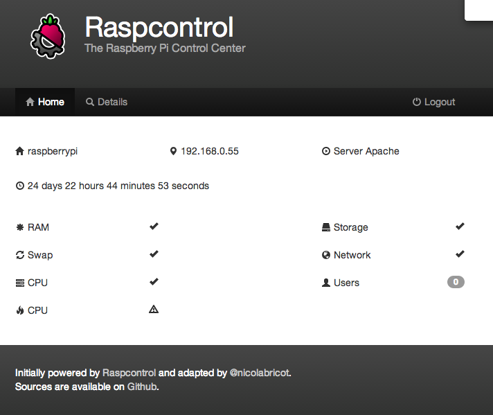

# Raspcontrol

This a modified version of the excellent [Raspcontrol](//github.com/Bioshox/Raspcontrol) from [Bioshox](//github.com/Bioshox).

This guide works with an apache server.

***

## Installation

### Source

You can download this as a _.zip_ from the Github repository via the following link: 

	https://github.com/nicolabricot/Raspcontrol/zipball/master

If you have Git installed you can also clone the repo

	git clone https://github.com/nicolabricot/Raspcontrol.git
	
When done, just put the files where your web server folder is installed

### Authentification file

You have to create a json format file in `/etc/raspcontrol` named `database.aptmnt`, for instance with `nano /etc/raspcontrol/database.aptmnt`, which contains:
	
	{
		"user":       "yourName",
		"password":   "yourPassword"
	}

### Statictics access

To get some statistics, we need to have some rigth. Adding `www-data` to the `video` group is a safe way. You can do that by executing the following command :

	usermod -a -G video www-data
	
### Drink coffee

That's all! You're ready to show the status of your raspberry pi :)
	
